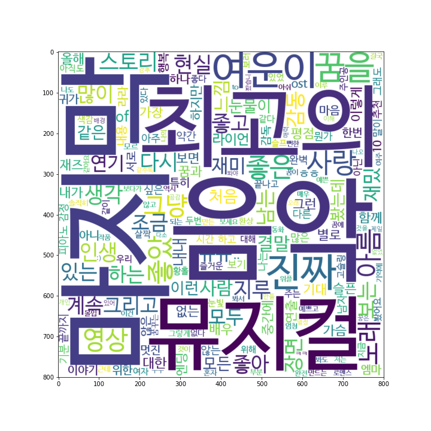

# KR-WordRank: Unsupervised Korean Word & Keyword Extractor

- pure Python code
- author: Lovit (Hyunjoong Kim)
- reference: [Kim, H. J., Cho, S., & Kang, P. (2014). KR-WordRank: An Unsupervised Korean Word Extraction Method Based on WordRank. Journal of Korean Institute of Industrial Engineers, 40(1), 18-33][paper]

## Keyword extraction

Substring graph를 만들기 위하여 substring의 최소 등장 빈도수 (min count)와 substring의 최대 길이 (max length)를 입력해야 합니다. 

```python
from krwordrank.word import KRWordRank

min_count = 5   # 단어의 최소 출현 빈도수 (그래프 생성 시)
max_length = 10 # 단어의 최대 길이
wordrank_extractor = KRWordRank(min_count=min_count, max_length=max_length)
```

KR-WordRank는 PageRank 와 비슷한 graph ranking 알고리즘을 이용하여 단어를 추출합니다 (HITS algorithm 을 이용합니다). Substring graph에서 node (substrig) 랭킹을 계산하기 위하여 graph  ranking 알고리즘의 parameters 가 입력되야 합니다. 

```python
beta = 0.85    # PageRank의 decaying factor beta
max_iter = 10
texts = ['예시 문장 입니다', '여러 문장의 list of str 입니다', ... ]
keywords, rank, graph = wordrank_extractor.extract(texts, beta, max_iter)
```

Graph ranking 이 높은 노드들(substrings)이 후처리 과정을 거쳐 단어로 출력됩니다. 영화 '라라랜드'의 영화 평 데이터에서 키워드 (단어) 추출을 한 결과 예시가 tutorials에 있습니다.

```python
for word, r in sorted(keywords.items(), key=lambda x:x[1], reverse=True)[:30]:
        print('%8s:\t%.4f' % (word, r))
```

      영화:    229.7889
     관람객:   112.3404
      너무:    78.4055
      음악:    37.6247
      정말:    37.2504
            ....

Python 의 wordcloud package 를 이용하면 키워드에 관한 word cloud figure 를 그릴 수 있습니다.

Figure 에 나타내지 않을 일반적인 단어 (stopwords) 를 제거하여 passwords 를 만듭니다. dict 형식으로 {단어:점수} 형식이어야 합니다. 

```python
stopwords = {'영화', '관람객', '너무', '정말', '보고'}
passwords = {word:score for word, score in sorted(
    keywords.items(), key=lambda x:-x[1])[:300] if not (word in stopwords)}
```

혹은 위의 과정을 간단히 summarize_with_keywords 함수로 진행할 수도 있습니다.

```python
from krwordrank.word import summarize_with_keywords

keywords = summarize_with_keywords(texts, min_count=5, max_length=10,
    beta=0.85, max_iter=10, stopwords=stopwords, verbose=True)
keywords = summarize_with_keywords(texts) # with default arguments
```

wordcloud 의 설치는 아래의 명령어로 설치할 수 있습니다.

    pip install wordcloud

wordcloud 가 이용하는 기본 폰트는 한글 지원이 되지 않습니다. 한글을 지원하는 본인의 폰트를 찾아 font_path 를 준비합니다. 그림의 크기 (width, height) 와 배경색 (background_color) 등을 지정한 뒤, generate_from_frequencies() 함수를 이용하여 그림을 그립니다.

```python
from wordcloud import WordCloud

# Set your font path
font_path = 'YOUR_FONT_DIR/truetype/nanum/NanumBarunGothic.ttf'

krwordrank_cloud = WordCloud(
    font_path = font_path,
    width = 800,
    height = 800,
    background_color="white"
)

krwordrank_cloud = krwordrank_cloud.generate_from_frequencies(passwords)
```

Jupyter notebook 에서 그림을 그릴 때에는 반드시 아래처럼 %matplotlib inline 을 입력해야 합니다. .py 파일로 만들 때에는 이를 입력하지 않습니다.

```python
%matplotlib inline
import matplotlib.pyplot as plt

fig = plt.figure(figsize=(10, 10))
plt.imshow(krwordrank_cloud, interpolation="bilinear")
plt.show()
```

그려진 그림을 저장할 수 있습니다. 

```python
fig.savefig('./lalaland_wordcloud.png')
```

저장된 그림은 아래와 같습니다. 



## Key-sentence extraction

KR-WordRank >= `1.0.0` 부터는 key sentence extraction 을 제공합니다. KR-WordRank 는 한국어의 토크나이저 기능이 내제되어 있기 때문에 토크나이징이 된 문장 간 유사도를 이용하는 TextRank 방식을 이용하기 어렵습니다. 대신 KR-WordRank 에서는 keywords 를 많이 포함한 문장을 핵심 문장으로 선택합니다. 문장을 추출하는 원리는 추출된 키워드의 랭크값을 이용하여 키워드 벡터를 만든 뒤, 코싸인 유사도 기준으로 입력된 문장 벡터가 키워드 벡터와 유사한 문장을 선택하는 것입니다.

summarize_with_sentences 함수에 texts 를 입력하면 KR-WordRank 를 학습하여 키워드와 이를 이용한 핵심 문장을 선택합니다.

```python
from krwordrank.sentence import summarize_with_sentences

texts = [] # 라라랜드 영화평
keywords, sents = summarize_with_sentences(texts, num_keywords=100, num_keysents=10)
```

keywords 에는 KR-WordRank 로부터 학습된 `num_keywords` 개수의 키워드와 이들의 랭크 값이 dict{str:float} 형식으로 저장되어 있습니다.

```
{'영화': 201.02402099523516,
 '너무': 81.53699026386887,
 '정말': 40.53709233921311,
 '음악': 40.43446188536923,
 '마지막': 38.598509495213484,
 '뮤지컬': 23.198810378709844,
 '최고': 21.810147306627464,
 '사랑': 20.638511587426862,
 '꿈을': 20.43744237599688,
 '아름': 20.324710458174806,
 '영상': 20.283994278960186,
 '여운이': 19.471356929084546,
 '진짜': 19.06433920013137,
 '노래': 18.732801785265316,
 ...
}
```
sents 에는 `num_sents` 개의 핵심 문장이 list of str 형식으로 포함되어 있습니다.

```
['여운이 크게남는영화 엠마스톤 너무 사랑스럽고 라이언고슬링 남자가봐도 정말 매력적인 배우인듯 영상미 음악 연기 구성 전부 좋았고 마지막 엔딩까지 신선하면서 애틋하구요 30중반에 감정이 많이 메말라있었는데 오랜만에 가슴이 촉촉해지네요',
 '영상미도 너무 아름답고 신나는 음악도 좋았다 마지막 세바스찬과 미아의 눈빛교환은 정말 마음 아팠음 영화관에 고딩들이 엄청 많던데 고딩들은 영화 내용 이해를 못하더라ㅡㅡ사랑을 깊게 해본 사람이라면 누구나 느껴볼수있는 먹먹함이 있다',
 '정말 영상미랑 음악은 최고였다 그리고 신선했다 음악이 너무 멋있어서 연기를 봐야 할지 노래를 들어야 할지 모를 정도로 그리고 보고 나서 생각 좀 많아진 영화 정말 이 연말에 보기 좋은 영화 인 것 같다',
 '무언의 마지막 피아노연주 완전 슬픔ㅠ보는이들에게 꿈을 상기시켜줄듯 또 보고 싶은 내생에 최고의 뮤지컬영화였음 단순할수 있는 내용에 뮤지컬을 가미시켜째즈음악과 춤으로 지루할틈없이 빠져서봄 ost너무좋았음',
 '처음엔 초딩들 보는 그냥 그런영화인줄 알았는데 정말로 눈과 귀가 즐거운 영화였습니다 어찌보면 뻔한 스토리일지 몰라도 그냥 보고 듣는게 즐거운 그러다가 정말 마지막엔 너무 아름답고 슬픈 음악이 되어버린',
 '정말 멋진 노래와 음악과 영상미까지 정말 너무 멋있는 영화 눈물을 흘리면서 봤습니다 영화가 끝난 순간 감탄과 동시에 여운이 길게 남아 또 눈물을 흘렸던내 인생 최고의 뮤지컬 영화',
 '평소 뮤지컬 영화 좋아하는 편인데도 평점에 비해 너무나 별로였던 영화 재즈음악이나 영상미 같은 건 좋았지만 줄거리도 글쎄 결말은 정말 별로 6 7점 정도 주는게 맞다고 생각하지만 개인적으로 후반부가 너무 별로여서',
 '오랜만에 좋은 영화봤다는 생각들었구요 음악도 영상도 스토리도 너무나좋았고 무엇보다 진한 여운이 남는 영화는 정말 오랜만이었어요 연인끼리 가서 보기 정말 좋은영화 너뮤너뮤너뮤 재밌게 잘 봤습니다',
 '음악 미술 연기 등 모든 것이 좋았지만 마지막 결말이 너무 현실에 뒤떨어진 꿈만 같다 꿈을 이야기하는 영화지만 과정과 결과에 있어 예술가들의 현실을 너무 반영하지 못한 것이 아닌가하는 생각이든다 그래서 보고 난 뒤 나는 꿈을 꿔야하는데 허탈했다',
 '마지막 회상씬의 감동이 잊혀지질않는다마지막 십분만으로 티켓값이 아깝지않은 영화 음악들도 너무 아름다웠다옛날 뮤지컬 같은 빈티지영상미도 최고']
```

몇 가지 패러매터를 추가할 수 있습니다. 길이가 지나치게 길거나 짧은 문장을 제거하기 위해 penalty 함수를 정의합니다. 아래는 길이가 25 글자부터 80 글자인 문장을 선호한다는 의미입니다. stopwords 는 키워드에서 제거합니다. 이들은 키워드벡터를 만들 때에도 이용되지 않습니다. 또한 키워드 벡터와 유사한 문장을 우선적으로 선택하다보면 이전에 선택된 문장과 중복되는 문장들이 선택되기도 합니다. 이는 `diversity` 를 이용하여 조절할 수 있습니다. `diversity` 는 코싸인 유사도 기준 핵심문장 간의 최소 거리 입니다. 이 값이 클수록 다양한 문장이 선택됩니다.

```python
penalty = lambda x:0 if (25 <= len(x) <= 80) else 1
stopwords = {'영화', '관람객', '너무', '정말', '진짜'}

keywords, sents = summarize_with_sentences(
    texts,
    penalty=penalty,
    stopwords = stopwords,
    diversity=0.5,
    num_keywords=100,
    num_keysents=10,
    verbose=False
)
```

이번에 추출된 키워드에는 `영화`, `관람객`, `너무` 와 같은 stopwords 가 제거되었습니다.

```
{'음악': 40.43446188536923,
 '마지막': 38.598509495213484,
 '뮤지컬': 23.198810378709844,
 '최고': 21.810147306627464,
 '사랑': 20.638511587426862,
 '꿈을': 20.43744237599688,
 '아름': 20.324710458174806,
 '영상': 20.283994278960186,
 '여운이': 19.471356929084546,
 '노래': 18.732801785265316,
 ...
}
```

핵심 문장도 길이가 25 ~ 80 글자인 문장들을 선호합니다.

```
['최고라는 말밖엔 음악 연출 영상 스토리 모두완벽 마지막 10분잊을수없다 한편의 뮤지컬을본듯한 느낌인생영화',
 '기대했었는데 저한텐 스토리도 음악도 평범했어요 영화보는내내 지루하다는 느낌을 많이 받았는데 신기하게도 마지막 씬을 보고나니 여운이 남네요',
 '슬펐지만 아름다웠던 두사람의 사랑과 갈등 그리고 음악 마지막 오버랩은 그냥 할말을 잃었습니다 여운이 남는 영화',
 '마지막 회상신에서 눈물이 왈칵 쏟아질뻔했다 올해중 최고의 영화를 본거 같다음악이며 배우들이며 영상이며 다시 또 보고싶은 그런 영화이다',
 '예쁜 영상과 아름다운 음악 꿈을 쫒는 두사람의 선택이 달랐다면 어땠을까 상상하는 장면이 인상깊었다 쓸쓸하지만 현실적인 사랑이랄까',
 '음악도 좋고 미아와 세바스티안의 아름다운 사랑과 예술에 대한 열정이 감동적이었습니다 재즈음악을 사랑하고 뮤지컬을 좋아하는 사람들에게 강추합니다',
 '생각보다 굉장히 재미있는 뻔한 결말도 아니고 아름다운 음악과 현실적인 스토리구성 모두에게 와닿을법한 울림들이 차 좋았어요 추천',
 '최고입니다 마지막 장면을 위해 음악과 함께 달려왔고현실적이지만 모두의 가슴을 뭉클하게 만드는 멋진 결말입니다 노래가 머리속에서 떠나질않네요',
 '먼저 음악이 너무 좋고아름다운 영상미만으로도 최고네요 아름답지만 짠내도 나구요 별 생각없이 봤는데 강추입니다 영화보고 계속 음악이 귀에 맴돌아요',
 '초반에 좀 지루하나 음악도 좋고 영상도 좋아서 보는 맛이 있어요 마지막이 좋았어요']
```

만약 `마지막`이라는 단어가 포함된 문장도 핵심 문장에서 제거하고 싶다면 아래처럼 `penalty` 함수를 변경할 수 있습니다.

```python
penalty=lambda x:0 if (25 <= len(x) <= 80 and not '마지막' in x) else 1,
keywords, sents = summarize_with_sentences(
    texts,
    penalty=penalty,
    stopwords = stopwords,
    diversity=0.5,
    num_keywords=100,
    num_keysents=10,
    verbose=False
)

print(sents)
```

```
['예쁜 영상과 아름다운 음악 꿈을 쫒는 두사람의 선택이 달랐다면 어땠을까 상상하는 장면이 인상깊었다 쓸쓸하지만 현실적인 사랑이랄까',
 '음악도 좋고 미아와 세바스티안의 아름다운 사랑과 예술에 대한 열정이 감동적이었습니다 재즈음악을 사랑하고 뮤지컬을 좋아하는 사람들에게 강추합니다',
 '생각보다 굉장히 재미있는 뻔한 결말도 아니고 아름다운 음악과 현실적인 스토리구성 모두에게 와닿을법한 울림들이 차 좋았어요 추천',
 '먼저 음악이 너무 좋고아름다운 영상미만으로도 최고네요 아름답지만 짠내도 나구요 별 생각없이 봤는데 강추입니다 영화보고 계속 음악이 귀에 맴돌아요',
 '사랑 꿈 현실 모든걸 다시한번 생각하게 하는 영화였어요 영상미도 너무 예쁘고 주인공도 예쁘고 내용도 아름답네요ㅠㅠ 인생 영화',
 '너무 좋은 영화 스토리는 비숫한것같아요 그래도 음악 영상 이루어지지않는 사랑을 더 매력적으로 전달한영화인것같아요 보고나서도 여운이 남는',
 '노래도 좋고 영상미도 좋고 그리고 배우들 연기까지 정말 좋았어요 개인적으로 뮤지컬 형식 영화를 안좋아하는 편인데 재밌게 봤습니다',
 '16년 최고의영화 인생영화입니다 영상미 색감 음악 감정선 다좋았는데 엔딩이 참현실적이네요 ㅎㅎ 참 공감되고 감동받았습니다 씁쓸하니 정말잘봤어요',
 '사실 두번째 보는 영화입니다 영상 편집과 음악이 너무 좋아요 어떻게 보면 너무나 현실적일 수 있는 결말이 슬프기하지만 아름답습니다',
 '영화사에 남을 최고의 뮤지컬영화입니다 음악과 영상이 너무 아름답고 두 주연배우의 연기는 매우 감동적입니다 무조건 보세요 최고']
```

더 자세한 key sentence extraction tutorials 은 tutorials 폴더의 krwordrank_keysentence.ipynb 파일을 참고하세요.

## Setup

```
pip install krwordrank
```

tested in
- python 3.5.9
- python 3.7.7

## Requirements

- Python >= 3.5
- numpy 
- scipy

[](https://github.com/lovit/kr-wordrank)

[paper]: https://github.com/lovit/KR-WordRank/raw/master/reference/2014_JKIIE_KimETAL_KR-WordRank.pdf
