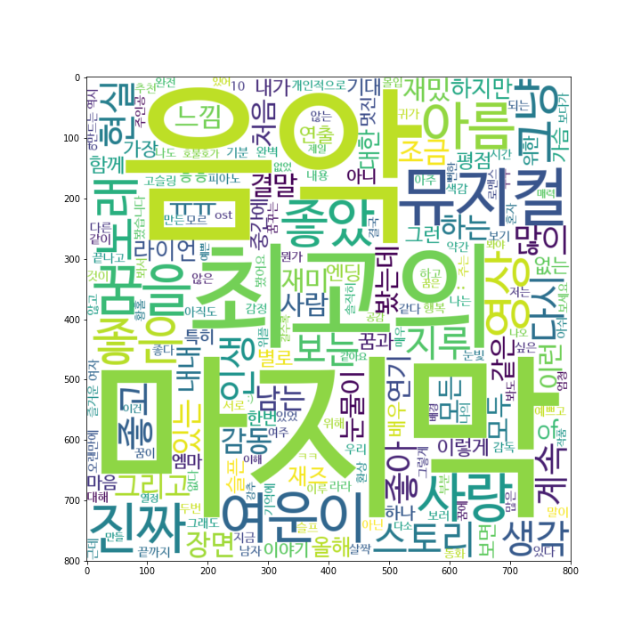

# KR-WordRank: Unsupervised Korean Word & Keyword Extractor

- pure Python code
- author: Lovit (Hyunjoong Kim)
- reference: [Kim, H. J., Cho, S., & Kang, P. (2014). KR-WordRank: An Unsupervised Korean Word Extraction Method Based on WordRank. Journal of Korean Institute of Industrial Engineers, 40(1), 18-33][paper]

## 동작 원리

KR-WordRank는 한국어 텍스트에서 별도의 형태소 분석기 없이 단어와 키워드를 추출합니다. 문장의 어절(공백 기준 토큰)을 substring으로 분해하여 그래프를 구성하고, PageRank와 유사한 HITS 알고리즘으로 각 substring의 중요도를 계산합니다. 랭킹이 높은 substring이 후처리를 거쳐 단어로 확정됩니다.

핵심 문장 추출은 추출된 키워드의 랭크값으로 키워드 벡터를 만든 뒤, 코사인 유사도 기준으로 키워드 벡터와 가장 유사한 문장을 순서대로 선택합니다.

## CLI

키워드 추출과 핵심 문장 추출을 명령줄에서 사용할 수 있습니다.

**입력 형식**

- **text** (기본): 한 줄에 한 문서. 탭이 있으면 첫 번째 컬럼만 사용(TSV 호환).
- **jsonl**: JSON Lines. 각 줄이 JSON 객체이며, 문서 텍스트는 `--field` 로 지정한 키의 값.

```bash
# 키워드만 추출 (텍스트 파일, 탭 구분 시 첫 컬럼 사용)
krwordrank keywords -i sentences.txt -n 50
krwordrank keywords -i sentences.txt -n 50 -s "영화,너무,정말" --json

# JSONL: 문서가 들어 있는 필드 지정
krwordrank keywords -i reviews.jsonl --format jsonl --field text -n 50

# 키워드 + 핵심 문장 추출
krwordrank keysents -i sentences.txt -k 10
krwordrank keysents -k 5 --keywords-only --number   # stdin, 문장만 번호와 함께 출력
```

- **keywords**: `-i` 입력 파일, `--format text|jsonl`, `--field` (jsonl일 때 필수), `-n` 개수, `-s` stopwords, `--json` 등
- **keysents**: `-i`, `--format`, `--field`, `-n`/`-k`, `--diversity`, `--min-len`/`--max-len`, `--show-indices` 등

자세한 옵션은 `krwordrank keywords --help`, `krwordrank keysents --help` 로 확인할 수 있습니다.

### 실행 예 (`-i`, `-n` 만 사용하는 경우)

입력 파일과 키워드 개수만 지정했을 때의 출력 예시입니다. (데이터: 라라랜드 영화 리뷰 `tests/integration/data/134963.txt`)

**keywords** — `krwordrank keywords -i tests/integration/data/134963.txt -n 15`

```
영화	201.021643
너무	81.536356
정말	40.536756
음악	40.434113
마지막	38.597046
뮤지컬	23.198629
최고	21.809913
사랑	20.638357
꿈을	20.437313
아름	20.324538
영상	20.283797
여운이	19.471221
진짜	19.064176
노래	18.732641
보고	18.567060
```

**keysents** — `krwordrank keysents -i tests/integration/data/134963.txt -n 20 -k 5`

키워드 목록(`keyword	단어	랭크`) 다음에 구분선 `---` 가 나오고, 그 아래 선택된 핵심 문장 5개가 출력됩니다.

```
keyword	영화	201.021643
keyword	너무	81.536356
... (상위 20개 키워드)
---
영상미도 너무 아름답고 신나는 음악도 좋았다 마지막 세바스찬과 미아의 눈빛교환은 정말 마음 아팠음 ...
정말 멋진 노래와 음악과 영상미까지 정말 너무 멋있는 영화 눈물을 흘리면서 봤습니다 ...
처음엔 초딩들 보는 그냥 그런영화인줄 알았는데 정말로 눈과 귀가 즐거운 영화였습니다 ...
무언의 마지막 피아노연주 완전 슬픔ㅠ보는이들에게 꿈을 상기시켜줄듯 또 보고 싶은 내생에 최고의 뮤지컬영화였음 ...
오랜만에 좋은 영화봤다는 생각들었구요 음악도 영상도 스토리도 너무나좋았고 ...
```

## Keyword extraction

### KRWordRank.extract

Substring graph를 만들기 위해 substring의 최소 등장 빈도수(`min_count`)와 최대 길이(`max_length`)를 지정합니다.

```python
from krwordrank.word import KRWordRank

wordrank_extractor = KRWordRank(
    min_count=5,   # 단어의 최소 출현 빈도수 (그래프 생성 시)
    max_length=10, # 단어의 최대 길이
)

texts = ['예시 문장 입니다', '여러 문장의 list of str 입니다', ...]

keywords, rank, graph = wordrank_extractor.extract(
    texts,
    beta=0.85,    # PageRank의 decaying factor beta
    max_iter=10,
)
```

`keywords`는 `{단어: 랭크}` 형태의 dict입니다. 라라랜드 영화 리뷰(15,603개)에서 추출한 결과 예시:

```python
for word, r in sorted(keywords.items(), key=lambda x: x[1], reverse=True)[:15]:
    print(f"{word:>8}:\t{r:.4f}")
```

```
      영화:	201.0224
      너무:	81.5366
      정말:	40.5369
      음악:	40.4342
    마지막:	38.5976
    뮤지컬:	23.1987
      최고:	21.8100
      사랑:	20.6384
      꿈을:	20.4374
      아름:	20.3246
      영상:	20.2839
    여운이:	19.4713
      진짜:	19.0642
      노래:	18.7327
      보고:	18.5671
```

### summarize_with_keywords

`num_keywords`개 키워드를 한 번에 추출하는 편의 함수입니다. `stopwords`로 제외할 단어를 지정할 수 있습니다.

```python
from krwordrank.word import summarize_with_keywords

stopwords = {'영화', '너무', '정말', '진짜', '보고'}

keywords = summarize_with_keywords(
    texts,
    num_keywords=100,
    min_count=5,
    max_length=10,
    beta=0.85,
    max_iter=10,
    stopwords=stopwords,
)
```

### Word Cloud

추출한 키워드로 word cloud를 그릴 수 있습니다. `wordcloud` 패키지를 별도로 설치해야 합니다.

```
pip install wordcloud
```

```python
from wordcloud import WordCloud

# wordcloud 기본 폰트는 한글을 지원하지 않으므로 한글 폰트 경로를 지정합니다
font_path = 'YOUR_FONT_DIR/truetype/nanum/NanumBarunGothic.ttf'

wc = WordCloud(
    font_path=font_path,
    width=800,
    height=800,
    background_color="white",
)
wc = wc.generate_from_frequencies(keywords)
```

```python
%matplotlib inline
import matplotlib.pyplot as plt

fig = plt.figure(figsize=(10, 10))
plt.imshow(wc, interpolation="bilinear")
plt.show()

fig.savefig('./tutorials/figs/lalaland_wordcloud.png')
```



## Key-sentence extraction

키워드를 많이 포함한 문장을 핵심 문장으로 선택합니다. 한국어 토크나이저 없이도 동작하며, 문장 간 유사도 대신 키워드 벡터와의 유사도를 기준으로 합니다.

### 기본 사용

```python
from krwordrank.sentence import summarize_with_sentences

texts = [...]  # list of str
keywords, sents = summarize_with_sentences(texts, num_keywords=100, num_keysents=10)
```

`keywords`는 `{단어: 랭크}` dict, `sents`는 핵심 문장의 `list of str`입니다.

```
{'영화': 201.0224, '너무': 81.5366, '정말': 40.5369, '음악': 40.4342, ...}

['여운이 크게남는영화 엠마스톤 너무 사랑스럽고 라이언고슬링 남자가봐도 정말 매력적인 배우인듯 ...',
 '영상미도 너무 아름답고 신나는 음악도 좋았다 마지막 세바스찬과 미아의 눈빛교환은 ...',
 ...]
```

### 파라미터

**`stopwords`**: 키워드 및 키워드 벡터에서 제외할 단어 집합입니다.

```python
stopwords = {'영화', '너무', '정말', '진짜'}
keywords, sents = summarize_with_sentences(
    texts, num_keywords=100, num_keysents=10, stopwords=stopwords
)
# keywords에 '영화', '너무' 등이 포함되지 않습니다
```

**`penalty`**: 선택하지 않을 문장에 페널티를 부여하는 함수입니다. 아래는 길이가 25 ~ 80 글자인 문장을 선호하는 예시입니다.

```python
def penalty(x):
    return 0 if 25 <= len(x) <= 80 else 1

keywords, sents = summarize_with_sentences(
    texts, num_keywords=100, num_keysents=10, penalty=penalty
)
```

**`diversity`**: 선택된 핵심 문장 간의 최소 코사인 거리입니다. 값이 클수록 서로 다른 내용의 문장이 선택됩니다. (기본값 0.3)

```python
keywords, sents = summarize_with_sentences(
    texts, num_keywords=100, num_keysents=10, diversity=0.5
)
```

**`return_indices`**: `True`로 설정하면 선택된 문장의 원문 인덱스를 함께 반환합니다.

```python
keywords, sents, idxs = summarize_with_sentences(
    texts, num_keywords=100, num_keysents=10, return_indices=True
)
# idxs: 선택된 문장의 texts 내 인덱스 list
# texts[idxs[i]] == sents[i]
```

더 자세한 튜토리얼은 `tutorials/krwordrank_keysentence.ipynb`를 참고하세요.

## Setup

[uv](https://docs.astral.sh/uv/)를 사용하여 환경을 관리합니다.

```bash
# Python 3.12 가상환경 생성 (처음 설정 시)
uv venv --python 3.12

# 패키지 설치
uv sync
```

pip으로 설치하려면:

```bash
pip install krwordrank
```

## Development

```bash
# 개발 의존성 포함 설치
uv sync --dev

# 테스트 실행 (unit)
uv run pytest tests/unit/ -v

# 테스트 실행 (integration)
uv run pytest tests/integration/ -v

# 전체 테스트
uv run pytest tests/ -v

# lint 검사 (ruff)
uv run ruff check krwordrank/ tests/

# pre-commit 훅 설치 및 실행
uv run pre-commit install
uv run pre-commit run --all-files
```

tested in
- Python 3.12.12

## Requirements

- Python >= 3.12
- numpy >= 1.18.4
- scipy >= 1.4.1
- scikit-learn >= 0.22.1

[paper]: https://github.com/lovit/KR-WordRank/raw/master/reference/2014_JKIIE_KimETAL_KR-WordRank.pdf
