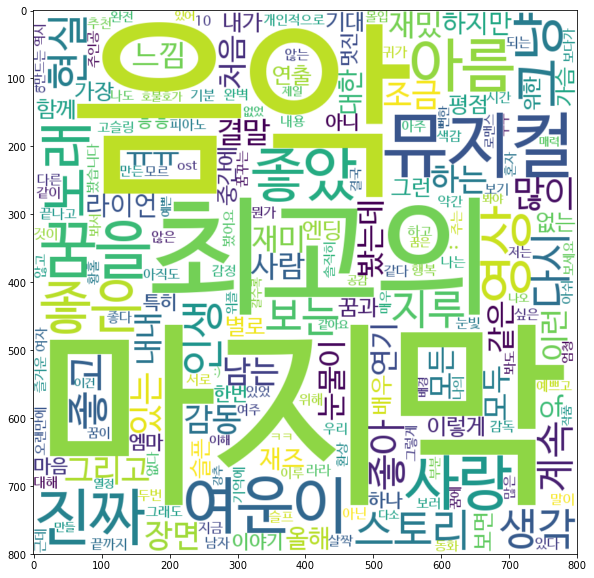

Word cloud 는 keywords 를 시각화하여 표현하는 좋은 수단입니다. Python 의 wordcloud package 를 이용하여 KR-WordRank 의 결과를 표현합니다. 

Package, wordcloud 의 사용법은 [여기][wordcloud]를 참고하세요. wordcloud 의 설치는 pip install 이 가능합니다. 

    pip install wordcloud

KR-WordRank 에 관련한 내용과 사용의 자세한 설명은 이 [튜토리얼][krwordrank_tutorial]을 참고하세요. 

[wordcloud]: https://github.com/amueller/word_cloud
[krwordrank_tutorial]: https://github.com/lovit/KR-WordRank/blob/master/tutorials/krwordrank_word_and_keyword_extraction.ipynb


```python
# load sample data


def get_texts_scores(fname):
    with open(fname, encoding="utf-8") as f:
        docs = [doc.lower().replace("\n", "").split("\t") for doc in f]
        docs = [doc for doc in docs if len(doc) == 2]

        if not docs:
            return [], []

        texts, scores = zip(*docs)
        return list(texts), list(scores)


# La La Land
fname = "../data/134963.txt"
texts, scores = get_texts_scores(fname)
```


```python
import sys

sys.path.append("../")

import krwordrank
from krwordrank.word import KRWordRank

print(krwordrank.__version__)
```

    0.1.3


```python
# train KR-WordRank model

wordrank_extractor = KRWordRank(
    min_count=5,  # 단어의 최소 출현 빈도수 (그래프 생성 시)
    max_length=10,  # 단어의 최대 길이
    verbose=True,
)

beta = 0.85  # PageRank의 decaying factor beta
max_iter = 10

keywords, rank, graph = wordrank_extractor.extract(texts, beta, max_iter)
```

    scan vocabs ... 
    num vocabs = 15964
    done = 10 Early stopped.


```python
# Check top 30 keywords with corresponding score

for word, r in sorted(keywords.items(), key=lambda x: -x[1])[:30]:
    print("%8s:\t%.4f" % (word, r))
```

          영화:	199.1862
         관람객:	110.5949
          너무:	89.4191
          정말:	42.3327
         마지막:	38.0814
          음악:	34.7721
         최고의:	22.3263
          보고:	22.1350
         뮤지컬:	22.0085
         여운이:	21.4165
          진짜:	21.3930
          꿈을:	21.3883
          사랑:	19.4885
          아름:	18.8450
          좋았:	18.8231
          좋은:	17.9560
          영상:	16.8227
          노래:	16.1577
          그냥:	15.7549
         스토리:	15.5779
          생각:	14.8758
          현실:	14.7699
          다시:	14.7597
          인생:	14.6162
          좋고:	14.0481
          지루:	13.8212
          보는:	13.3998
          계속:	12.7141
          좋아:	12.5200
          많이:	12.3452


```python
# remove stopwords

stopwords = {"영화", "관람객", "너무", "정말", "보고"}
passwords = {word: score for word, score in sorted(keywords.items(), key=lambda x: -x[1])[:300] if word not in stopwords}

print("num passwords = {}".format(len(passwords)))
```

    num passwords = 295


```python
# draw word cloud using generate_from_frequencies()
# You should set font path for Korean.

from wordcloud import WordCloud

# Set your font path
font_path = "/usr/share/fonts/truetype/nanum/NanumBarunGothic.ttf"

krwordrank_cloud = WordCloud(font_path=font_path, width=800, height=800, background_color="white")

krwordrank_cloud = krwordrank_cloud.generate_from_frequencies(passwords)
```


```python
# show figure using matplotlib

%matplotlib inline
import matplotlib.pyplot as plt

fig = plt.figure(figsize=(10, 10))
plt.imshow(krwordrank_cloud, interpolation="bilinear")
plt.show()
```


    

    


```python
# save figure

fig.savefig("figs/lalaland_wordcloud.png")
```


```python

```
